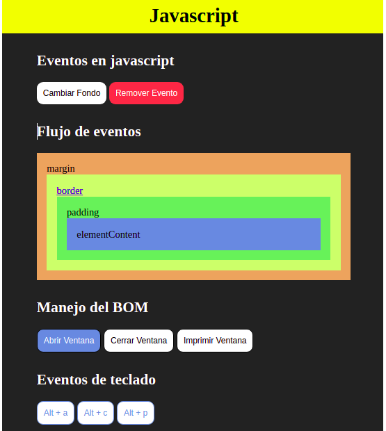

# Eventos en Javascript y el BOM (Browser Object Model)

 

 

## Manejo de eventos

Para asignar un evento a un elemento de html primero tengo que tener una forma de identificarlo para poder llevarlo a una variable.

Nota: el nombre de la variable que guarda un elemento html deben comenzar con $, por ejemplo, $div.

Desde esta variable podemos cambiarle las propiedades y asignarle eventos al elemento. Tambien hay formas de remover eventos.

<i style="color:green">preventDefault</i> cancela el evento por defecto del elemento, por ejemplo, la etiqueta a tiene como evento por defecto abrir el enlace.

Cada elemento html tiene definida su propia lista de posibles eventos que se le pueden asignar. Un mismo elemento puede tener asociados diferentes eventos.
Estos son los eventos más importantes definidos por JavaScript:

 

<table>
<thead>
<tr>
<th>Evento</th>
<th>Descripción</th>
<th>Elementos para los que está definido</th>
</tr>
</thead>
<tbody>
<tr>
<td><code>onblur</code></td>
<td>Deseleccionar el elemento</td>
<td><code>&lt;button&gt;</code>, <code>&lt;input&gt;</code>, <code>&lt;label&gt;</code>, <code>&lt;select&gt;</code>, <code>&lt;textarea&gt;</code>, <code>&lt;body&gt;</code></td>
</tr>
<tr>
<td><code>onchange</code></td>
<td>Deseleccionar un elemento que se ha modificado</td>
<td><code>&lt;input&gt;</code>, <code>&lt;select&gt;</code>, <code>&lt;textarea&gt;</code></td>
</tr>
<tr>
<td><code>onclick</code></td>
<td>Pinchar y soltar el ratón</td>
<td>Todos los elementos</td>
</tr>
<tr>
<td><code>ondblclick</code></td>
<td>Pinchar dos veces seguidas con el ratón</td>
<td>Todos los elementos</td>
</tr>
<tr>
<td><code>onfocus</code></td>
<td>Seleccionar un elemento</td>
<td><code>&lt;button&gt;</code>, <code>&lt;input&gt;</code>, <code>&lt;label&gt;</code>, <code>&lt;select&gt;</code>, <code>&lt;textarea&gt;</code>, <code>&lt;body&gt;</code></td>
</tr>
<tr>
<td><code>onkeydown</code></td>
<td>Pulsar una tecla (sin soltar)</td>
<td>Elementos de formulario y <code>&lt;body&gt;</code></td>
</tr>
<tr>
<td><code>onkeypress</code></td>
<td>Pulsar una tecla</td>
<td>Elementos de formulario y <code>&lt;body&gt;</code></td>
</tr>
<tr>
<td><code>onkeyup</code></td>
<td>Soltar una tecla pulsada</td>
<td>Elementos de formulario y <code>&lt;body&gt;</code></td>
</tr>
<tr>
<td><code>onload</code></td>
<td>La página se ha cargado completamente</td>
<td><code>&lt;body&gt;</code></td>
</tr>
<tr>
<td><code>onmousedown</code></td>
<td>Pulsar (sin soltar) un botón del ratón</td>
<td>Todos los elementos</td>
</tr>
<tr>
<td><code>onmousemove</code></td>
<td>Mover el ratón</td>
<td>Todos los elementos</td>
</tr>
<tr>
<td><code>onmouseout</code></td>
<td>El ratón <em>"sale"</em> del elemento (pasa por encima de otro elemento)</td>
<td>Todos los elementos</td>
</tr>
<tr>
<td><code>onmouseover</code></td>
<td>El ratón <em>"entra"</em> en el elemento (pasa por encima del elemento)</td>
<td>Todos los elementos</td>
</tr>
<tr>
<td><code>onmouseup</code></td>
<td>Soltar el botón que estaba pulsado en el ratón</td>
<td>Todos los elementos</td>
</tr>
<tr>
<td><code>onreset</code></td>
<td>Inicializar el formulario (borrar todos sus datos)</td>
<td><code>&lt;form&gt;</code></td>
</tr>
<tr>
<td><code>onresize</code></td>
<td>Se ha modificado el tamaño de la ventana del navegador</td>
<td><code>&lt;body&gt;</code></td>
</tr>
<tr>
<td><code>onselect</code></td>
<td>Seleccionar un texto</td>
<td><code>&lt;input&gt;</code>, <code>&lt;textarea&gt;</code></td>
</tr>
<tr>
<td><code>onsubmit</code></td>
<td>Enviar el formulario</td>
<td><code>&lt;form&gt;</code></td>
</tr>
<tr>
<td><code>onunload</code></td>
<td>Se abandona la página (por ejemplo al cerrar el navegador)</td>
<td><code>&lt;body&gt;</code></td>
</tr>
</tbody>
</table>

 

## Flujo de eventos

El flujo de eventos permite que varios elementos diferentes puedan responder a un mismo evento.
El orden en el que se ejecutan los eventos asignados a cada elemento de la página se lo puede asignar del interior al exterior (fase de burbuja) o del exterior al interior (fase de captura).
Con <i style="color:green">stopPropagation</i> podemos parar la propagacion de eventos.

## delegacion de eventos

En lugar de tener varios listeners, es mas eficiente asignarle solamente un "listener" al "<i style="color:blue">document</i>" y través de un condicional evaluamos quien origino el evento.
Esta forma de delegar eventos tiene dos ventajas mas, la primera es que no hace falta poner el <i style="color:green">stopPropagation</i> porque ya estamos evitando la propagacion de eventos. La segunda es que no saldran errores a la hora de crear o borrar elementos del dom, ya que no puede haber "listener" de elementos que no estan cargados en el dom.

## Eventos de teclado

- <i style="color:green">keydown</i>: cuando apreciono una tecla
- <i style="color:green">keyup</i>: cuando dejo de presionar la tecla

Podemos usar estos eventos para crear aplicaciones con atajos de teclado.

## El BOM: Browser Object Model

Son los metodos y objetos que cuelgan directamente de <i style="color:blue">windows</i> y que hacen referencia a la ventana del navegador

### Eventos del BOM:

- <i style="color:green">load</i>

se ejecuta despues de que la pagina se termina de cargar completa

- <i style="color:green">DOMContentLoaded</i>

Es buena practica usar este evento porque es mas rapido que load pero no espera que se cargen todos los elementos de la pagina , como imagenes, etc

- <i style="color:green">resize</i>

Se ejecuta cuando cambiamos el tamaño de la ventana

- <i style="color:green">scroll</i>

Se ejecuta cuando movemos el scrool

## objetos del BOM: location, history y navegator

Con estos objetos vamos a poder obtener informacion sobre el navegador:

- <i style="color:green">location</i>: nos da el protocolo, el nombre del dominio, el puerto, el url completo, etc.
- <i style="color:green">history</i>: nos da el historial de las paginas visitadas.
- <i style="color:green">navegator</i>: nos la informacion de conexion como la geolocalizacion, si el usuario perdio la conexion, etc.
